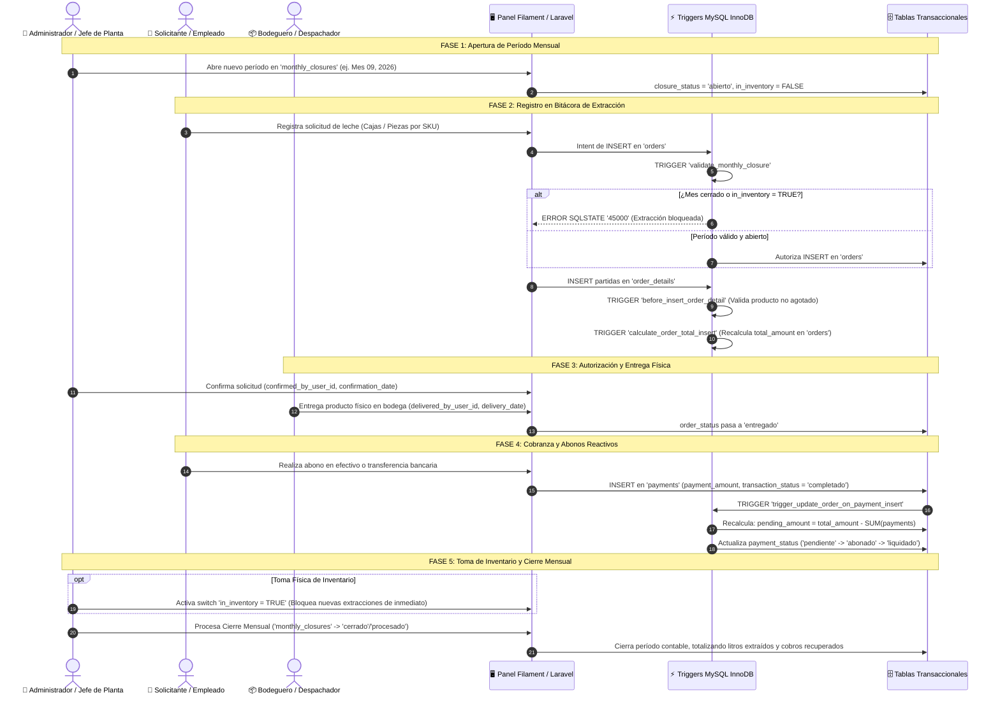
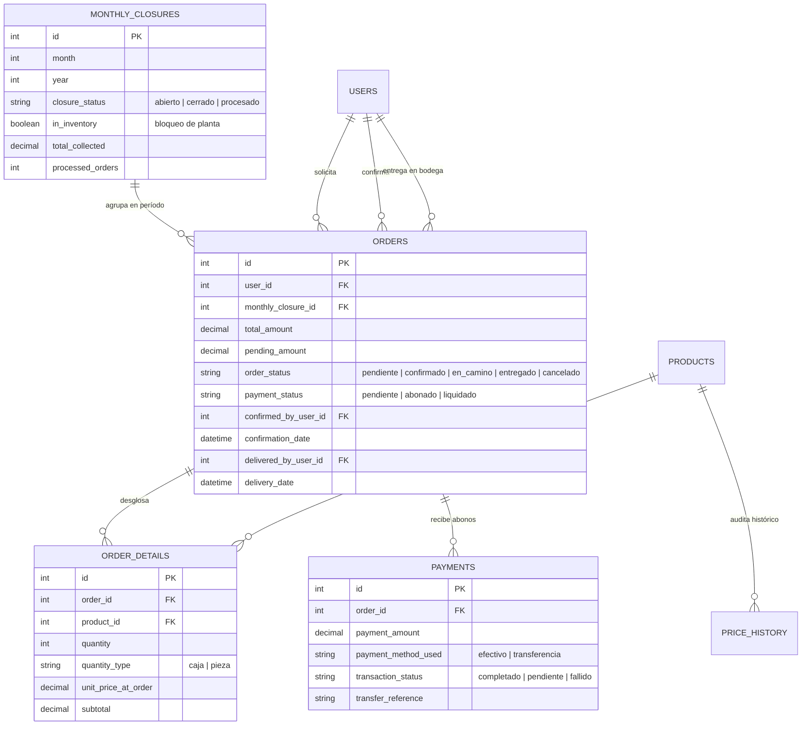

# Sistema de Bitácora Digital y Control de Extracción/Despacho de Leche por Períodos Mensuales


Sistema corporativo de grado industrial desarrollado para el control estricto de **bitácoras de extracción, despacho y cobranza de dotaciones de leche** por períodos mensuales en plantas y centros de distribución de **Liconsa**. 

Construido sobre una arquitectura **Hybrid Core (Laravel 12 + Filament v4 + Triggers y Vistas Nativas en MySQL InnoDB)**, garantiza que las reglas críticas de negocio (bloqueo por toma física de inventario, sumatorias de pedidos, cálculo reactivo de saldos en abonos y auditoría histórica de precios) se ejecuten a nivel de motor de base de datos, evitando fallas por concurrencia o manipulación externa.

---

## 🎯 Caso de Uso y Problemática Operativa

En plantas procesadoras y centros de acopio lácteos, la entrega de producto a empleados, rutas y beneficiarios institucionales requiere un control milimétrico:
* **Extracciones no autorizadas fuera de período:** Retiros de producto cuando el mes fiscal ya fue cerrado contablemente.
* **Fuga de producto durante tomas físicas de inventario:** Cuando el almacén entra en conteo físico, cualquier salida descalibra los balances auditados.
* **Cobranza parcial o en abonos:** Empleados y puntos de retiro reciben dotaciones que liquidan en parcialidades (efectivo o transferencia). Si la aplicación web falla al calcular el saldo pendiente (`pending_amount`), se generan discrepancias contables.
* **Falta de trazabilidad física:** Incapacidad de auditar con precisión **quién autorizó la extracción** en sistema y **qué bodeguero entregó físicamente el producto** en patio.

---

## 🔄 Flujo Operativo Exacto de la Bitácora (End-to-End)



---

## ⚡ Lógica de Integridad en Triggers Nativos (MySQL Engine)

A diferencia de desarrollos convencionales que delegan la lógica financiera a controladores PHP, este sistema implementa **Triggers nativos en MySQL** para blindar la operación:

### 1. Validación de Período Mensual y Bloqueo de Inventario Físico
Impide terminantemente el alta de órdenes si el período no está activo o si el almacén está en recuento físico:

```sql
CREATE TRIGGER `validate_monthly_closure` 
BEFORE INSERT ON `orders` 
FOR EACH ROW BEGIN
    DECLARE estado_cierre VARCHAR(20);
    DECLARE modo_inventario BOOLEAN;
    
    SELECT `closure_status`, `in_inventory` 
    INTO estado_cierre, modo_inventario
    FROM `monthly_closures` 
    WHERE `id` = NEW.`monthly_closure_id`;
    
    IF estado_cierre IS NULL THEN
        SIGNAL SQLSTATE '45000'
        SET MESSAGE_TEXT = 'Error: Período mensual no válido';
    ELSEIF estado_cierre != 'abierto' THEN
        SIGNAL SQLSTATE '45000'
        SET MESSAGE_TEXT = 'Error: El período está cerrado contablemente';
    ELSEIF modo_inventario = TRUE THEN
        SIGNAL SQLSTATE '45000'
        SET MESSAGE_TEXT = 'Error: Sistema bloqueado temporalmente por inventario físico en planta';
    END IF;
END;
```

### 2. Recálculo Reactivo de Saldo Insoluto y Estatus de Pago
Al registrar un abono en `payments`, MySQL recalcula en tiempo real el saldo pendiente y actualiza el estatus del pedido (`pendiente`, `abonado` o `liquidado`):

```sql
CREATE TRIGGER `trigger_update_order_on_payment_insert` 
AFTER INSERT ON `payments` 
FOR EACH ROW BEGIN
    -- 1. Actualiza el importe insoluto en la orden
    UPDATE `orders` 
    SET `pending_amount` = `total_amount` - (
        SELECT COALESCE(SUM(`payment_amount`), 0) 
        FROM `payments` 
        WHERE `order_id` = NEW.`order_id` 
        AND `transaction_status` = 'completado'
    )
    WHERE `id` = NEW.`order_id`;

    -- 2. Asigna atómicamente el nuevo estatus de liquidación
    UPDATE `orders`
    SET `payment_status` = (
        CASE 
            WHEN `pending_amount` <= 0 THEN 'liquidado'
            WHEN `pending_amount` < `total_amount` THEN 'abonado'
            ELSE 'pendiente'
        END
    )
    WHERE `id` = NEW.`order_id`;
END;
```

### 3. Recálculo Automático del Monto Total por Detalle
Cada partida agregada, editada o eliminada en `order_details` dispara la sincronización del acumulado general:

```sql
CREATE TRIGGER `calculate_order_total_insert` 
AFTER INSERT ON `order_details` 
FOR EACH ROW BEGIN
    UPDATE `orders` 
    SET `total_amount` = (
        SELECT SUM(`subtotal`) 
        FROM `order_details` 
        WHERE `order_id` = NEW.`order_id`
    ) 
    WHERE `id` = NEW.`order_id`;
END;
```

### 4. Auditoría Inmutable de Precios (`price_history`)
Cualquier actualización en el precio oficial del catálogo de leche queda registrada automáticamente para efectos de auditoría gubernamental:

```sql
CREATE TRIGGER `after_update_products_price` 
AFTER UPDATE ON `products` 
FOR EACH ROW BEGIN
    IF OLD.`current_unit_price` != NEW.`current_unit_price` THEN
        INSERT INTO `price_history` (
            `product_id`, `previous_price`, `new_price`, `changed_by_user_id`
        ) VALUES (
            NEW.`id`, OLD.`current_unit_price`, NEW.`current_unit_price`, COALESCE(NEW.`updated_by_user_id`, 1)
        );
    END IF;
END;
```

---

## 🏛️ Modelo de Datos y Vistas SQL de Auditoría



### Vistas SQL Optimizadas para Reportería Institucional:
* **`view_monthly_sales`:** Resumen consolidado del mes fiscal: total de pedidos, clientes únicos, cajas totales, piezas sueltas, importe entregado y total recaudado.
* **`view_payment_status`:** Matriz de saldos por empleado/solicitante: total asignado, abonos completados, balance insoluto y estatus textual.
* **`view_order_details_complete`:** Sábana de auditoría que cruza solicitud, entrega física en bodega con usuario responsable y comparativa de precio del día vs. precio actual.
* **`view_available_products`:** Catálogo de productos disponibles con desglose dinámico de precio por caja y precio por pieza individual.

---

## 💻 Stack Tecnológico

| Capa | Tecnología | Función |
| :--- | :--- | :--- |
| **Backend Core** | PHP 8.2+ / Laravel 12.x | Lógica de controladores, modelos Eloquent, migraciones y seeders. |
| **Panel Administrativo** | Filament v4 | Interfaz reactiva para altas de bitácora, widgets de ventas y tablas de auditoría. |
| **Integridad & Reglas** | MySQL InnoDB Triggers | Validación de bloqueos de inventario y recálculo de importes a nivel de motor. |
| **Consultas Analíticas** | Vistas Nativas SQL | Reportes mensuales agregados de extracción y liquidación sin sobrecargar PHP. |
| **Seguridad y Acceso** | Spatie Laravel-Permission | Roles institucionales: Administrador, Auditor, Almacenista y Solicitante. |
| **Frontend & Estilos** | Tailwind CSS / Vite 6 | Estilos modernos, responsivos y componentes visuales ligeros. |

---

## 🚀 Instalación y Despliegue Local

### Requisitos Previos:
- **PHP** >= 8.2 con extensiones `pdo_mysql`, `mbstring`, `openssl`, `bcmath`, `curl`.
- **Composer** >= 2.x
- **MySQL** >= 8.0 o **MariaDB** >= 10.5 (con soporte completo para Triggers y Views).
- **Node.js** >= 18.x y **NPM**.

### Pasos:

1. **Clonar el repositorio:**
   ```bash
   git clone https://github.com/DesarrolladorWebFrias/gestion-pedidos-leche-2025.git
   cd gestion-pedidos-leche-2025
   ```

2. **Instalar dependencias de PHP:**
   ```bash
   composer install
   ```

3. **Configurar variables de entorno:**
   ```bash
   cp .env.example .env
   php artisan key:generate
   ```

4. **Configurar la base de datos en `.env`:**
   ```env
   DB_CONNECTION=mysql
   DB_HOST=127.0.0.1
   DB_PORT=3306
   DB_DATABASE=bitacora_pedidos_leche
   DB_USERNAME=root
   DB_PASSWORD=tu_password
   ```

5. **Ejecutar migraciones (genera tablas, triggers y vistas automáticamente):**
   ```bash
   php artisan migrate --seed
   ```

6. **Compilar assets del frontend:**
   ```bash
   npm install
   npm run build
   ```

7. **Iniciar servidor local:**
   ```bash
   php artisan serve
   ```
   *Acceder al panel de administración en: `http://127.0.0.1:8000/admin`*

---

## 👨‍💻 Autor y Desarrollador

**Lic. Luis Andrés López Frías**  
*Licenciado en Sistemas Computacionales | Especialista Full Stack & Bases de Datos Transaccionales*  
- **GitHub:** [@DesarrolladorWebFrias](https://github.com/DesarrolladorWebFrias)  
- **GitLab:** [@luisandreslopezfrias23](https://gitlab.com/luisandreslopezfrias23)  
- **Enfoque Técnico:** Sistemas Críticos de Cadena de Suministro, ERPs Corporativos, Triggers SQL y Arquitecturas Offline-First  
- **Ubicación:** Villahermosa, Tabasco, México
