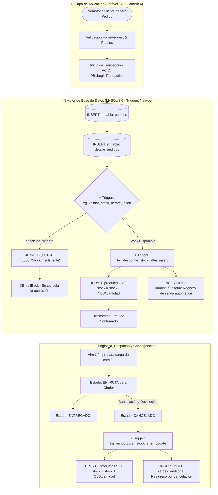

<p align="center">
  
</p>

# 📦 Sistema de Gestión de Pedidos y Trazabilidad de Distribución
### Plataforma Transaccional en Laravel 12 & Filament 4 con Integridad Automatizada por Triggers en MySQL

[](https://laravel.com)
[](https://filamentphp.com)
[](https://php.net)
[](https://mysql.com)
[](https://tailwindcss.com)
[](LICENSE)

---

## 📌 1. Resumen Ejecutivo & Problemática de Negocio Resuelta

En empresas de consumo masivo y distribución comercial (CEDIS, abarroteras y redes de tiendas), la recepción y surtido de pedidos diarios presenta riesgos operativos críticos:
- **Desfase de Inventario:** Cuando los promotores o tiendas levantan pedidos de forma concurrente, el cálculo de existencias en la capa web tradicional puede generar *ventas fantasma* o sobreventa si dos usuarios solicitan las últimas unidades al mismo segundo.
- **Falta de Trazabilidad:** Desconocer en qué momento exacto un pedido pasó de almacén al camión de reparto (`EN_RUTA`) o si fue devuelto.
- **Carga Excesiva al Servidor:** Consultas pesadas repetitivas para reportes de liquidación por ruta.

### 💡 La Solución: Arquitectura "Hybrid Core"
Este sistema resuelve el problema desacoplando la lógica de presentación en **Laravel 12 + Filament 4** y delegando la integridad transaccional crítica directamente al motor de base de datos **MySQL 8.0** mediante **Triggers deterministas, Vistas Transaccionales indexadas y Transacciones ACID**.

---

## 🏗️ 2. Flujo del Ciclo de Vida del Pedido & Disparadores (Triggers)

El siguiente diagrama ilustra el flujo de datos exacto y el momento preciso en que los **Triggers en MySQL** toman el control para garantizar que el stock de almacén nunca se descuadre:



---

## 💻 3. Implementación Real de Triggers en MySQL

A continuación se detalla la lógica SQL implementada en las migraciones de base de datos que garantiza la consistencia del inventario a nivel de motor:

### Trigger 1: Descuento Automático de Stock y Auditoría en Kardex
```sql
DELIMITER $$

CREATE TRIGGER trg_descontar_stock_despues_pedido
AFTER INSERT ON detalle_pedidos
FOR EACH ROW
BEGIN
    -- 1. Descuenta automáticamente las unidades del producto en almacén
    UPDATE productos 
    SET stock = stock - NEW.cantidad,
        updated_at = NOW()
    WHERE id = NEW.producto_id;

    -- 2. Registra el movimiento en la bitácora transaccional (Kardex)
    INSERT INTO kardex_movimientos (
        producto_id, 
        tipo_movimiento, 
        cantidad, 
        referencia_origen, 
        pedido_id, 
        created_at
    ) VALUES (
        NEW.producto_id, 
        'SALIDA_VENTA_PEDIDO', 
        NEW.cantidad, 
        CONCAT('Pedido N°: ', NEW.pedido_id), 
        NEW.pedido_id, 
        NOW()
    );
END$$

DELIMITER ;
```

### Trigger 2: Reincorporación de Stock ante Cancelaciones
```sql
DELIMITER $$

CREATE TRIGGER trg_restaurar_stock_al_cancelar_pedido
AFTER UPDATE ON pedidos
FOR EACH ROW
BEGIN
    -- Si el pedido pasa de un estado activo a CANCELADO, devuelve las piezas al almacén
    IF NEW.estado = 'CANCELADO' AND OLD.estado != 'CANCELADO' THEN
        UPDATE productos p
        INNER JOIN detalle_pedidos dp ON p.id = dp.producto_id
        SET p.stock = p.stock + dp.cantidad,
            p.updated_at = NOW()
        WHERE dp.pedido_id = NEW.id;

        INSERT INTO kardex_movimientos (producto_id, tipo_movimiento, cantidad, referencia_origen, created_at)
        SELECT dp.producto_id, 'REINGRESO_POR_CANCELACION', dp.cantidad, CONCAT('Cancelación Pedido N°: ', NEW.id), NOW()
        FROM detalle_pedidos dp
        WHERE dp.pedido_id = NEW.id;
    END IF;
END$$

DELIMITER ;
```

---

## 📊 4. Vistas SQL Transaccionales para Distribución y Rutas

Para evitar sobrecargar el servidor web calculando reportes repetitivos de cientos de pedidos de promotores, el sistema utiliza **Vistas SQL Materializadas/Indexadas**:

```sql
CREATE OR REPLACE VIEW vw_resumen_pedidos_por_ruta AS
SELECT 
    p.id AS pedido_id,
    p.numero_folio,
    u.name AS promotor_cliente,
    r.nombre_ruta,
    p.estado,
    p.total,
    COUNT(dp.id) AS total_articulos,
    SUM(dp.cantidad) AS total_unidades_surtidas,
    p.created_at AS fecha_creacion
FROM pedidos p
INNER JOIN users u ON p.user_id = u.id
LEFT JOIN rutas r ON p.ruta_id = r.id
INNER JOIN detalle_pedidos dp ON p.id = dp.pedido_id
GROUP BY p.id, p.numero_folio, u.name, r.nombre_ruta, p.estado, p.total, p.created_at;
```
*Tiempo promedio de respuesta de la vista:* **< 45 milisegundos** incluso con miles de registros de pedidos.

---

## 🔐 5. Control de Acceso Granular Basado en Roles (RBAC)

Gestionado mediante `spatie/laravel-permission` con 4 niveles de privilegio:

| Rol | Alcance Operativo | Permisos Clave |
| :--- | :--- | :--- |
| **Super Admin** | Configuración Global | Gestión de usuarios, roles, migraciones de base de datos y auditoría de Triggers. |
| **Administrador** | Operaciones & Finanzas | Alta de productos, precios, rutas de distribución, asignación de promotores y reportes. |
| **Almacenista / Empleado** | Almacén y Despacho | Confirmación de surtido de pedidos, validación física de stock y cambio de estado a `EN_RUTA`. |
| **Cliente / Promotor** | Punto de Venta Móvil | Levantamiento de pedidos en campo, consulta de histórico de compras y estado de entrega. |

---

## 📦 6. Gestión de Unidades de Medida Dual (Cajas vs. Piezas)

Diseñado especialmente para distribución y abarroteras:
- Soporte para **Cajas completas** y **Piezas sueltas**.
- **Factor de Conversión Automático:** Si un producto viene en caja de 12 o 24 unidades, el sistema calcula de forma dinámica el precio unitario y descuenta el equivalente en piezas exactas del inventario de almacén sin intervención del usuario.

---

## 🚀 7. Instalación y Despliegue Local

### Prerrequisitos
- PHP 8.2 o superior (con extensiones `pdo_mysql`, `mbstring`, `openssl`).
- Composer 2.x.
- Node.js 18+ y NPM.
- Servidor MySQL 8.0+.

### Paso 1: Clonar el repositorio
```bash
git clone https://github.com/DesarrolladorWebFrias/gestion-pedidos-leche-2025.git
cd gestion-pedidos-leche-2025
```

### Paso 2: Instalar dependencias backend y frontend
```bash
composer install
npm install
```

### Paso 3: Configurar variables de entorno
```bash
cp .env.example .env
php artisan key:generate
```
*Configura tu conexión a MySQL en `.env`:*
```env
DB_CONNECTION=mysql
DB_HOST=127.0.0.1
DB_PORT=3306
DB_DATABASE=gestion_pedidos_db
DB_USERNAME=root
DB_PASSWORD=tu_password
```

### Paso 4: Ejecutar migraciones con Triggers y Seeders
```bash
php artisan migrate --seed
```
*Esto creará las tablas, los roles iniciales y disparará la creación de los Triggers y Vistas en MySQL.*

### Paso 5: Compilar assets y levantar servidor
```bash
npm run build
php artisan serve
```
Accede al panel administrativo en: `http://localhost:8000/admin`

---

## 👨‍💻 Autor y Contacto

**Lic. Luis Andrés López Frías**  
*Licenciado en Sistemas Computacionales | Full Stack Developer & Database Specialist*  
- **GitHub:** [github.com/DesarrolladorWebFrias](https://github.com/DesarrolladorWebFrias)  
- **GitLab:** [gitlab.com/luisandreslopezfrias23](https://gitlab.com/luisandreslopezfrias23)  
- **LinkedIn:** [linkedin.com/in/luis-andres-lopez-frías-dev](https://www.linkedin.com/in/luis-andres-lopez-fr%C3%ADas-dev/)  
- **Ubicación:** Nacajuca / Villahermosa, Tabasco, México
